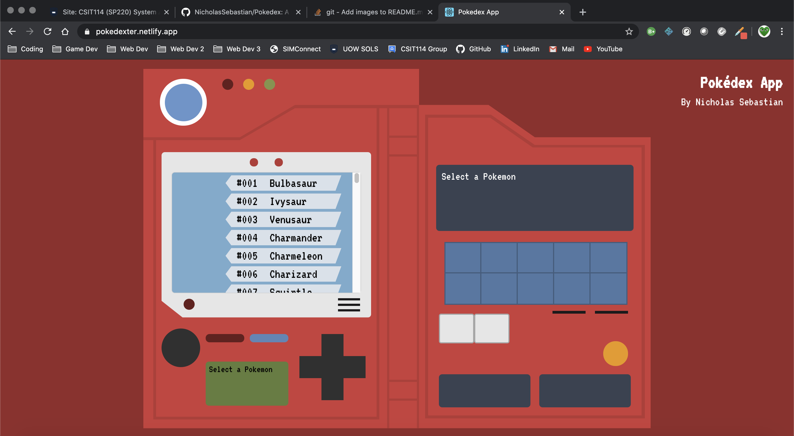

## Pokedex Web App

https://pokedexter.netlify.app/

Made to simulate the look and feel of the Pokedex in the anime series. 
Though functionality wise, it wasn't made to give a lot of information, it was only meant to look cool. 
The amount of CSS I had to write was horrendous.

### Purpose
Another random project I randomly felt like doing. 
Also, I wanted to practice using React's hooks and its context API, and since this project has multiple screens which in themselves are seperate individual components, it makes it perfect for trying out sharing states among multiple components.

### Attribution
This app was made using [PokeAPI](https://pokeapi.co/), a public REST API for pokemon information. 
Specifically, I used https://github.com/PokeAPI/pokeapi-js-wrapper for its built-in caching.
